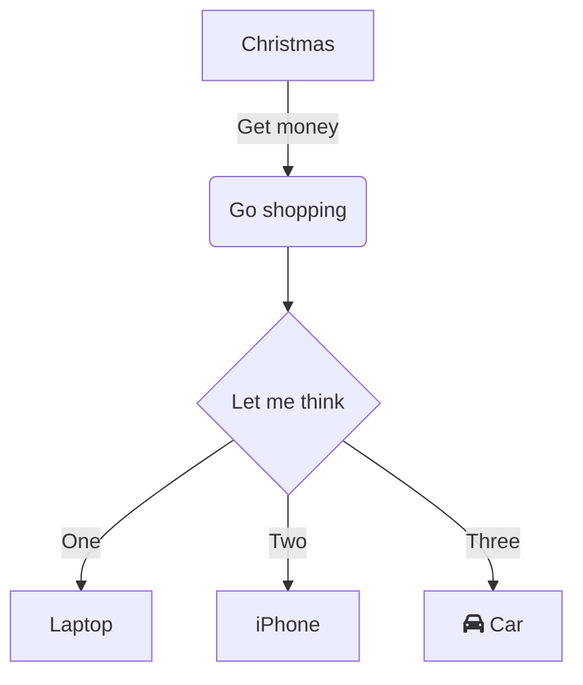

#  docsify 

## :man: :baseball:安装与使用
```bash
npm i docsify-cli -g
# 当前目录下创建一个docs 文件夹.文档写在里面 
docsify init ./docs
# 预览网页
docsify serve docs
# 自动生成侧边栏
docsify g docs
```
##  markdown 相关

### 原版的tip
?> 框里都变绿色了

!> 红色感叹号

> An awesome project.

### 增强的tip

> [!NOTE]
> An alert of type 'note' using global style 'callout'.

> [!TIP]
> An alert of type 'tip' using global style 'callout'.


> [!WARNING]
> An alert of type 'warning' using global style 'callout'.

> [!ATTENTION]
> An alert of type 'attention' using global style 'callout'.

> [!NOTE|style:flat]
> An alert of type 'note' using alert specific style 'flat' which overrides global style 'callout'.

- 可以指定icon
http://www.fontawesome.com.cn/faicons/
可以在 index.html里 设置, icon : "fa fa-comment"

> [!TIP|style:flat|label:My own heading|iconVisibility:hidden]
> An alert of type 'tip' using alert specific style 'flat' which overrides global style 'callout'.
> In addition, this alert uses an own heading and hides specific icon.


As you can see in the second snippet, output can be configured on alert level also. Supported options are listed in following table:

| Key             | Allowed value                                           |
| --------------- | ------------------------------------------------------- |
| style           | One of follwowing values: callout, flat                 |
| label           | Any text                                                |
| icon            | A valid Font Awesome icon, e.g. 'fas fa-comment'        |
| className       | A name of a CSS class which specifies the look and feel |
| labelVisibility | One of follwowing values: visible (default), hidden     |
| iconVisibility  | One of follwowing values: visible (default), hidden     |


### 语法高亮
https://cdn.jsdelivr.net/npm/prismjs@1/components/
index.html添加
```html
<script src="//cdn.jsdelivr.net/npm/prismjs@1/components/prism-bash.min.js"></script>
```

###  图片
在当前目录下放置一个me.png 即可
```

```

### mermaid


## tab 的使用
>[!note]
> 注意 是#### 然后 标题要****包起来.加粗

>[!warning]
> ****包起来的标题,如果与其他 tab 里的标题一样, **会导致 这边点击标签,那边的tab也会切换到相同名字的标题**
> 所以建议使用不同的标题名字


<!-- tabs:start -->
#### **Rendered**
hello
#### **Markdown**
world

<!-- tabs:end -->


## 插入emoji
https://www.webfx.com/tools/emoji-cheat-sheet/

<!-- tabs:start -->
#### **效果**
:bowtie:
:smile:
:laughing:
:blush:
:smiley:
:relaxed:
:smirk:
:100:
:smile:

#### **markdown**
```
:bowtie:
:smile:
:laughing:
:blush:
:smiley:
:relaxed:
:smirk:
:100:
:smile:
```
<!-- tabs:end -->


## copy 代码的使用

如果你里面放的是用户名和密码之类的话,使用

```
    ```text
    ```
```

```text
yourpassword
```

这个就不会在后面加一个换行符了,导致密码错误.....


## 图标icon的使用

```
name|block or inline| color | height and weight will be the same|horizontal or vertical
use 
\_\_healthicons:eye|b|#000|48|v\_\_  
两边用2个_ 包起来
--> delete the \
```
__healthicons:eye|b|#ooo|48__ abc

__healthicons:joints-outline|i|#ooo|48|v__ef

__healthicons:gallbladder__

__healthicons:female-reproductive-system-outline__